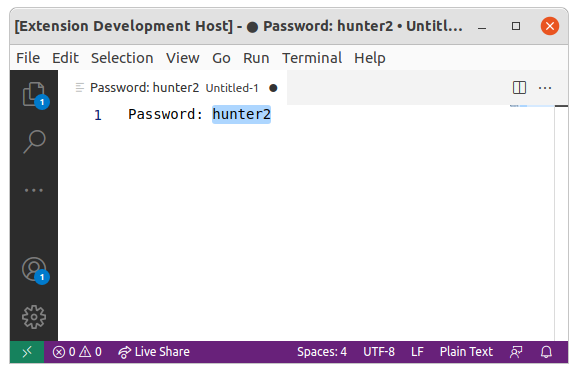
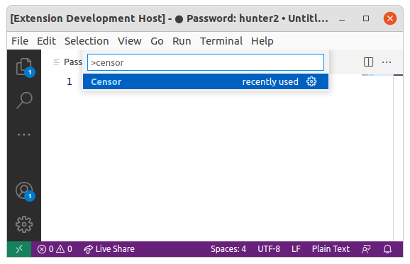
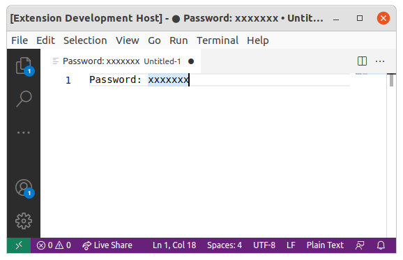

# black-highlighter README

A quick way to black out or censor highlighted text.

## Features

This extension can easily replace highlighted text by x's of the same amount to make blocking out sensitive information easier.

For example if there is an image subfolder under your extension project workspace:

## Release Notes

Users appreciate release notes as you update your extension.

### 1.0.0

Initial release of Black Highlighter.
`Censor` function.

